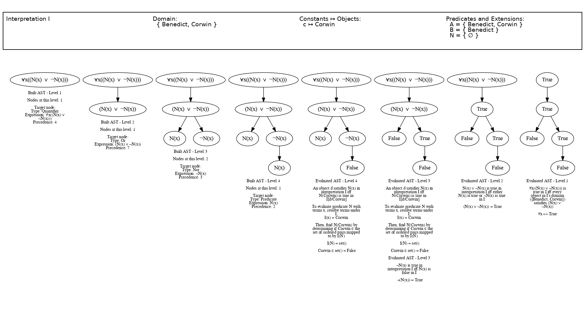

> Generated by code below.

```python
I_a = (
    Interpretation()
    .add_to_domain(["Corwin", "Benedict"])
    .add_predicate(Predicate("A", 1).extend("Corwin").extend("Benedict"))
    .add_predicate(Predicate("B", 1).extend("Benedict"))
    .add_predicate(Predicate("N", 1))
    .add_constant_object_mapping(Constant("c"), "Corwin")
)

formula = remap_symbols("∀x(N(x) or !N(x))")
tree = Parser(tokenize(formula), I_a).parse()

image = center_and_stitch_vertical(
    [
        create_interpretation_image(I_a, trees_image.width),
        stitch_horizontal(
            [
                visualize_ast_progressively(tree),
                visualize_progressive_evaluation(tree, I_a),
            ]
        ),
    ]
)
image.save("..output/formula_under_interpretation.png")
```
