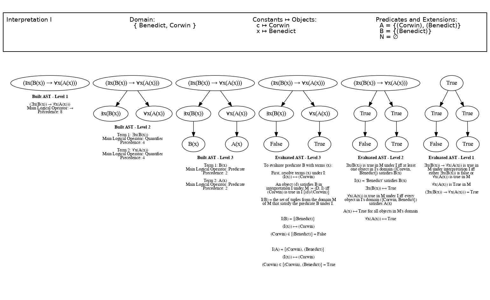

> Generated by code below.

```python
M = (
    Model("M")
    .with_domain(DomainOfDiscourse("D").expand(["Corwin", "Benedict"]))
    .with_interpretation_function(
        Interpretation()
        .add_predicate(Predicate("A", 1).extend("Corwin").extend("Benedict"))
        .add_predicate(Predicate("B", 1).extend("Benedict"))
        .add_predicate(Predicate("N", 1))
        .extend(Constant("c"), "Corwin")
    )
)

formula = "∃x(B(x)) → ∀x(A(x))"

ast= Parser(formula, M).parse()
trees_image = stitch_horizontal(
    [
        visualize_ast_progressively(ast),
        visualize_evaluation_progressively(ast, M),
    ]
)
final_image = center_and_stitch_vertical(
    [create_interpretation_image(M.I, trees_image.width), trees_image]
)
final_image.save("../output/formula_under_M.png")

result = evaluate(ast, M.I)
# >>> M ⊨ ∃x(B(x)) → ∀x(A(x)).
```
